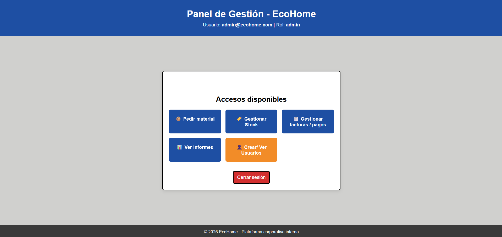
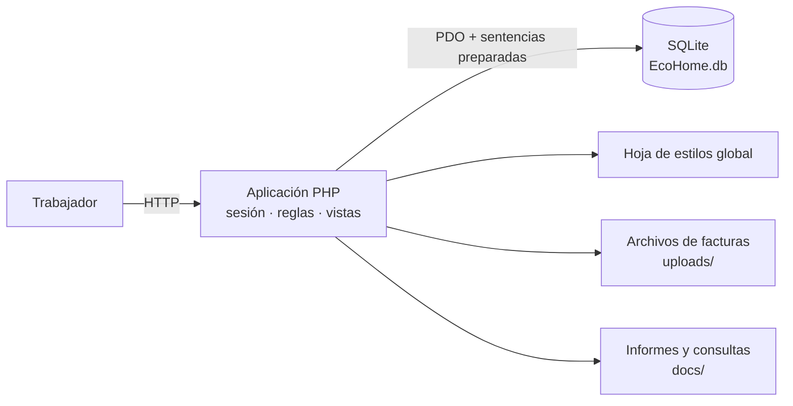
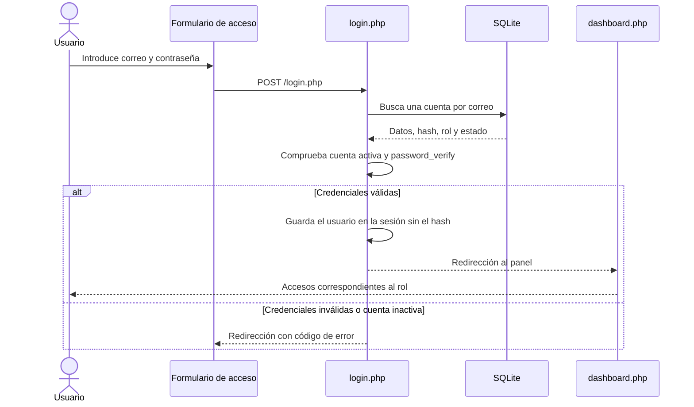
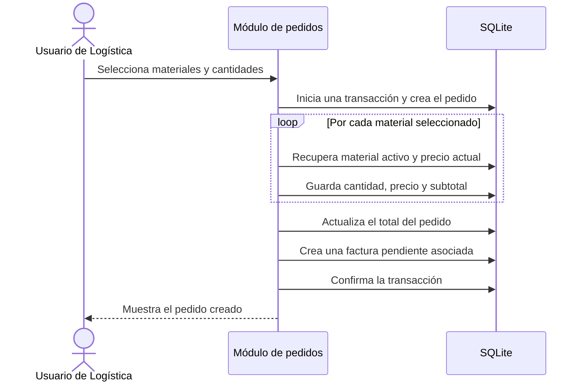
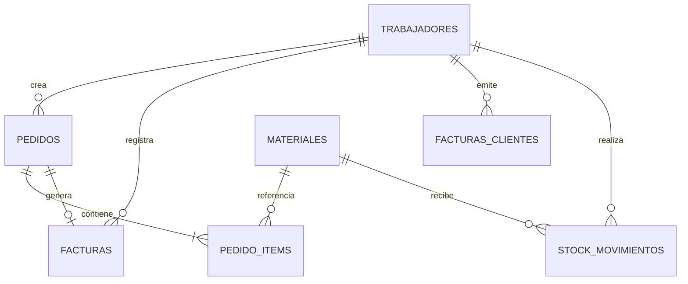

# EcoHome ERP

> Prototipo funcional de un ERP web para centralizar la gestión de pedidos, stock, facturas, pagos, trabajadores e informes de la empresa ficticia EcoHome.


EcoHome ERP nace como parte de una propuesta de transformación digital. Su objetivo es sustituir procesos dispersos —como el intercambio de información mediante WhatsApp o el mantenimiento de hojas de cálculo aisladas— por una aplicación corporativa única, trazable y accesible desde el navegador.

El proyecto reproduce varios procesos habituales de una empresa: administración de trabajadores, solicitud de materiales, control de existencias, generación de facturas, seguimiento de pagos y consulta de informes. Aunque su alcance es académico, plantea una base modular que puede evolucionar hacia un ERP más amplio, incorporar funciones de CRM y conectarse en el futuro con dispositivos IoT.

## Índice

- [Vista de la aplicación](#vista-de-la-aplicación)
- [Objetivos](#objetivos)
- [Funcionalidades](#funcionalidades)
- [Roles y permisos](#roles-y-permisos)
- [Arquitectura](#arquitectura)
- [Estructura del repositorio](#estructura-del-repositorio)
- [Flujos de negocio](#flujos-de-negocio)
- [Modelo de datos](#modelo-de-datos)
- [Decisiones técnicas](#decisiones-técnicas)
- [Módulos PHP](#módulos-php)
- [Seguridad](#seguridad)
- [Tecnologías](#tecnologías)
- [Ejecución local](#ejecución-local)
- [Usuarios de prueba](#usuarios-de-prueba)
- [Consultas y documentación](#consultas-y-documentación)
- [Pruebas](#pruebas)
- [Qué demuestra este proyecto](#qué-demuestra-este-proyecto)
- [Evolución prevista](#evolución-prevista)
- [Autor y contacto](#-autor-y-contacto)
- [Licencia](#-licencia)

## Vista de la aplicación

Esta captura ofrece una vista general de EcoHome ERP y muestra el panel de gestión disponible para un usuario administrador. Desde este panel se accede a los módulos principales de pedidos, stock, facturación, informes y trabajadores.



Por el momento, esta es la imagen principal de la aplicación incluida en el README. La galería se ampliará en futuras versiones con capturas específicas de cada módulo y de sus flujos de trabajo.

El funcionamiento completo de la aplicación puede verse en el siguiente vídeo:

[Ver demostración de EcoHome ERP en YouTube](https://youtu.be/LtaSYJ0hnrg)

Las tarjetas visibles se adaptan al rol del usuario conectado, por lo que cada perfil encuentra únicamente los accesos relacionados con sus responsabilidades.

## Objetivos

- Centralizar la información operativa en una única base de datos.
- Mejorar la trazabilidad de pedidos, movimientos de stock, facturas y pagos.
- Reducir la dependencia de herramientas no corporativas y datos duplicados.
- Facilitar la consulta de información actualizada para la toma de decisiones.
- Aplicar control de acceso según las responsabilidades de cada trabajador.
- Demostrar cómo una estrategia tecnológica puede alinearse con las necesidades del negocio.
- Ofrecer una base ampliable hacia módulos de CRM, analítica e IoT.

## Funcionalidades

### Autenticación y trabajadores

- Inicio y cierre de sesión mediante correo electrónico y contraseña.
- Contraseñas almacenadas como hashes y verificadas con las funciones nativas de PHP.
- Bloqueo de acceso para cuentas desactivadas.
- Alta de trabajadores con datos personales, credenciales y rol.
- Edición de los datos y del estado activo de una cuenta.
- Eliminación de trabajadores, evitando que un usuario elimine su propia cuenta mientras está conectado.
- Presentación dinámica de los accesos disponibles en función del rol.

### Pedidos de materiales

- Consulta del catálogo de materiales activos, sus unidades y su precio unitario.
- Selección de cantidades para varios materiales en un mismo pedido.
- Creación de una cabecera de pedido y de sus líneas asociadas.
- Recuperación del precio desde la base de datos antes de calcular cada subtotal.
- Cálculo del importe total en el servidor.
- Generación automática de una factura de empresa en estado `pendiente`.
- Consulta de pedidos recientes y visualización de sus líneas.

> Actualmente, crear un pedido no descuenta existencias. El pedido registra la solicitud y su coste; los cambios de inventario se realizan expresamente desde el módulo de stock.

### Stock

- Consulta del stock actual y del precio de los materiales.
- Registro de movimientos de tipo `entrada`, `salida` o `ajuste`.
- Actualización atómica de las unidades y creación simultánea del registro histórico.
- Asociación de cada movimiento con el trabajador que lo realizó.
- Notas opcionales para explicar la operación.
- Validación para impedir que una salida deje el stock en negativo.
- Consulta de los últimos 100 movimientos.

En la implementación actual, tanto una `entrada` como un `ajuste` suman la cantidad indicada; una `salida` la resta.

### Facturas y pagos

- Separación entre facturas de empresa y facturas emitidas a clientes.
- Creación automática de facturas de empresa desde los pedidos.
- Creación manual de facturas de clientes con nombre, correo, concepto, base imponible e IVA.
- Cálculo del total de la factura de cliente en el servidor.
- Adjunto opcional de una imagen de la factura.
- Listados independientes de facturas pendientes y pagadas.
- Cambio explícito del estado de una factura a `pagada`.
- Visualización segura del documento asociado a una factura de cliente.

Las imágenes adjuntas admiten JPG, PNG y WEBP, tienen un límite de 5 MB y se guardan con un nombre aleatorio dentro de `uploads/`.

### Informes

- Resumen del número e importe de facturas pendientes y pagadas.
- Informes diferenciados para facturas de empresa y de clientes.
- Consulta de stock actual.
- Historial de operaciones de inventario.
- Filtros y vistas agrupadas para facilitar el análisis operativo.
- Consultas SQL de ejemplo para facturación, pedidos, materiales y actividad de trabajadores.

## Roles y permisos

La autorización se comprueba en cada módulo PHP, además de condicionar los accesos visibles en el panel principal.

| Recurso u operación | `admin` | `Gestion` | `Logistica` | `RRHH` | `Directivos` |
|---|:---:|:---:|:---:|:---:|:---:|
| Panel principal | Sí | Sí | Sí | Sí | Sí |
| Consultar pedidos | Sí | Sí | Sí | Sí | Sí |
| Crear pedidos | Sí | No | Sí | No | No |
| Consultar y modificar stock | Sí | No | Sí | No | No |
| Acceder al módulo general de facturas | Sí | Sí | No | Sí, lectura | No |
| Crear facturas y registrar pagos | Sí | Sí | No | No | No |
| Consultar informes | Sí | Sí | No | Sí | Sí |
| Gestionar trabajadores | Sí | No | No | Sí | No |

`admin` dispone de acceso operativo completo. `Logistica` concentra pedidos y stock; `Gestion`, facturación, pagos e informes; `Directivos`, la consulta de informes; y `RRHH`, la administración de trabajadores y diversas vistas de consulta.

## Arquitectura

La aplicación utiliza una arquitectura web monolítica y sencilla. Cada página PHP combina el control de acceso, el caso de uso, las consultas SQL y la generación de HTML. La conexión a la base de datos está centralizada en `db.php`.



| Área | Responsabilidad |
|---|---|
| Entrada y sesión | Presentar el login, autenticar al trabajador, mantener la sesión y cerrar sesión. |
| Panel | Mostrar únicamente los accesos principales relacionados con el rol conectado. |
| Páginas de módulo | Validar permisos, ejecutar operaciones y renderizar las vistas de negocio. |
| Persistencia | Mantener trabajadores, materiales, pedidos, facturas y movimientos mediante SQLite. |
| Recursos públicos | Aplicar los estilos compartidos de la interfaz. |
| Almacenamiento documental | Conservar las imágenes opcionales asociadas a facturas de clientes. |

### Características de la arquitectura actual

- No depende de un framework PHP ni de un proceso de compilación.
- Las páginas se renderizan en el servidor.
- La navegación y las operaciones usan formularios y redirecciones HTTP.
- PDO ofrece una interfaz única de conexión y lanza excepciones ante errores.
- SQLite permite distribuir el prototipo con una base de datos ya preparada.
- Las operaciones que afectan a varios registros utilizan transacciones.

## Estructura del repositorio

```text
.
├── app/
│   ├── includes/                  # Espacio reservado para código reutilizable
│   └── pages/
│       ├── facturas/              # Facturas, pagos y documentos adjuntos
│       ├── informes/              # Informes de facturación y stock
│       ├── pedidos/               # Creación, listado y detalle de pedidos
│       ├── stock/                 # Inventario e historial de movimientos
│       └── usuarios/              # Alta, edición y eliminación de trabajadores
├── docs/
│   └── Documentacion/             # Inicio local, consultas SQL y cuentas de prueba
├── img/
│   └── fondo.png                  # Recurso gráfico del proyecto
├── public/
│   └── assets/css/style.css       # Estilos globales
├── storage/
│   └── db/EcoHome.db              # Base de datos SQLite
├── uploads/                       # Imágenes asociadas a facturas de clientes
├── dashboard.php                  # Panel principal por rol
├── db.php                         # Factoría de conexión PDO
├── index.php                      # Pantalla de acceso
├── login.php                      # Procesamiento de credenciales
├── logout.php                     # Cierre de sesión
└── README.md
```

`app/includes/` queda preparado para extraer componentes, helpers o controles comunes en futuras refactorizaciones. `storage/` contiene datos internos y no debería exponerse directamente en un despliegue con servidor web real.

## Flujos de negocio

### Inicio de sesión y autorización



### Pedido y factura de empresa



### Movimiento de stock

El sistema valida el material, el tipo de movimiento y la cantidad. Después calcula la variación, comprueba que el resultado no sea negativo y, en una misma transacción, actualiza las unidades y registra quién realizó la operación. Si falla cualquiera de los pasos, se revierte el conjunto.

### Factura de cliente

Gestión introduce los datos comerciales y, opcionalmente, una imagen justificativa. El servidor valida los campos y el archivo, calcula `base imponible × (1 + IVA / 100)` y crea la factura como pendiente. Más adelante puede marcarse como pagada desde el módulo correspondiente.

## Modelo de datos



| Tabla | Finalidad |
|---|---|
| `trabajadores` | Identidad, contacto, hash de contraseña, rol, estado y fecha de alta. |
| `materiales` | Catálogo de materiales, unidades disponibles, precio unitario y estado activo. |
| `pedidos` | Cabecera del pedido, trabajador responsable, fecha e importe total. |
| `pedido_items` | Líneas con material, cantidad, precio unitario y subtotal del momento del pedido. |
| `facturas` | Facturas de empresa asociadas a pedidos, con total y estado de pago. |
| `facturas_clientes` | Facturas emitidas a clientes, con concepto, importes, IVA y archivo opcional. |
| `stock_movimientos` | Historial de entradas, salidas y ajustes, asociado a material y trabajador. |

Las líneas del pedido conservan el precio unitario y el subtotal utilizados al crearlo. De este modo, cambiar posteriormente el precio del material no altera el importe histórico del pedido.

## Decisiones técnicas

### PHP sin framework

La implementación utiliza PHP nativo para que el flujo HTTP, las sesiones, la validación, las redirecciones y el acceso SQL sean visibles de forma directa. Esto reduce las dependencias del prototipo, aunque a medida que crezca convendrá separar controladores, servicios y vistas.

### SQLite como base de datos embebida

Toda la persistencia reside en `storage/db/EcoHome.db`. El proyecto puede arrancar sin configurar un servidor de base de datos independiente, una ventaja para demostraciones y entregas académicas. En un entorno con más concurrencia podría migrarse a MariaDB o PostgreSQL.

### Servidor como fuente de verdad

Los totales no se aceptan directamente desde el formulario. Al crear un pedido, el servidor recupera el precio vigente de cada material y calcula los subtotales. Al emitir una factura de cliente, calcula el total a partir de la base y del IVA validados.

### Transacciones para operaciones relacionadas

La creación de pedido, sus líneas, su total y la factura asociada se confirma como una única unidad. El movimiento de inventario aplica el mismo principio para la actualización del stock y su entrada de historial.

### Redirección después de operaciones POST

Los formularios que modifican datos suelen responder mediante una redirección. Este patrón evita repetir accidentalmente una operación al recargar la página y permite presentar mensajes de éxito o error mediante parámetros controlados.

### Documentos fuera de la base de datos

La base guarda la ruta relativa de las imágenes de factura, no su contenido binario. Los archivos se almacenan en `uploads/` con nombres generados mediante tiempo y bytes aleatorios.

## Módulos PHP

### Archivos principales

| Archivo | Responsabilidad |
|---|---|
| `index.php` | Presenta el formulario de acceso o redirige al panel si ya existe una sesión. |
| `login.php` | Busca al trabajador, comprueba estado y contraseña, y crea la sesión. |
| `logout.php` | Destruye la sesión activa y devuelve al usuario al acceso. |
| `dashboard.php` | Muestra las tarjetas de navegación adecuadas para el rol. |
| `db.php` | Abre la conexión PDO a SQLite, activa claves foráneas y configura excepciones. |

### Usuarios

| Archivo | Responsabilidad |
|---|---|
| `usuarios.php` | Crear trabajadores y mostrar su listado. |
| `usuarios_edit.php` | Editar información, rol, contraseña y estado. |
| `usuarios_delete.php` | Eliminar una cuenta con controles de sesión y rol. |

### Pedidos y stock

| Archivo | Responsabilidad |
|---|---|
| `pedidos.php` | Mostrar materiales disponibles, formulario de pedido y pedidos recientes. |
| `pedidos_crear.php` | Validar cantidades y crear pedido, líneas y factura dentro de una transacción. |
| `pedido_ver.php` | Mostrar la cabecera, las líneas y el total de un pedido. |
| `stock.php` | Consultar inventario, aplicar movimientos y mostrar el historial reciente. |

### Facturación

| Archivo | Responsabilidad |
|---|---|
| `facturas.php` | Servir como menú del área de facturación y pagos. |
| `facturas_crear.php` | Crear facturas de clientes y procesar imágenes opcionales. |
| `facturas_pagos.php` | Listar facturas pendientes de empresa y clientes. |
| `facturas_pagadas.php` | Listar facturas cuyo pago ya se ha registrado. |
| `factura_empresa_pagar.php` | Marcar una factura de empresa como pagada. |
| `factura_cliente_pagar.php` | Marcar una factura de cliente como pagada. |
| `ver_factura_cliente.php` | Validar la referencia y mostrar la imagen asociada. |

### Informes

| Archivo | Responsabilidad |
|---|---|
| `informes.php` | Menú principal de informes. |
| `informes_facturas.php` | Accesos a los diferentes informes de facturación. |
| `informes_facturas_resumen.php` | Totales y número de facturas por tipo y estado. |
| `informes_facturas_empresa.php` | Detalle de facturas generadas desde pedidos. |
| `informes_facturas_clientes.php` | Detalle de facturas emitidas a clientes. |
| `informes_stock.php` | Menú de informes de inventario. |
| `informes_stock_ver.php` | Vista del stock actual. |
| `informes_stock_operaciones.php` | Historial de movimientos de materiales. |

## Seguridad

- Contraseñas verificadas mediante `password_verify`; el hash no se guarda en la sesión.
- Sesiones PHP obligatorias para todas las áreas internas.
- Comprobaciones de rol dentro de los archivos que muestran o modifican información.
- Consultas parametrizadas con PDO para los valores introducidos por el usuario.
- Escapado con `htmlspecialchars` al representar datos dinámicos en HTML.
- Validación de identificadores, cantidades, importes, correos y estados permitidos.
- Claves foráneas activadas en cada conexión SQLite.
- Transacciones y reversión ante errores en pedidos y movimientos de stock.
- Verificación del MIME real, tamaño máximo y extensión permitida para las imágenes.
- Generación aleatoria del nombre de los archivos subidos.
- Restricción de las rutas esperadas antes de mostrar un documento adjunto.

> La configuración actual está orientada a desarrollo local. Para producción deben añadirse HTTPS, cookies de sesión endurecidas, protección CSRF, gestión segura de secretos, registros de auditoría y una configuración del servidor que impida el acceso web directo a `storage/` y `docs/`.

El archivo de documentación de cuentas contiene credenciales exclusivamente para pruebas locales. No debe publicarse con contraseñas reales ni reutilizarse en un despliegue.

## Tecnologías

| Área | Tecnología | Uso |
|---|---|---|
| Backend | PHP 8+ | Sesiones, reglas de negocio, validación y renderizado HTML. |
| Persistencia | SQLite | Base de datos embebida del prototipo. |
| Acceso a datos | PDO SQLite | Conexión, consultas preparadas y transacciones. |
| Frontend | HTML5 | Formularios, tablas y estructura de las vistas. |
| Estilos | CSS3 | Diseño global, tarjetas, formularios y adaptación visual. |
| Seguridad de credenciales | Password Hashing API de PHP | Creación y verificación de hashes de contraseña. |
| Servidor local | Servidor integrado de PHP | Ejecución del proyecto sin servidor externo. |

## Ejecución local

### Requisitos

- PHP 8 o una versión compatible con las características utilizadas.
- Extensiones `PDO` y `pdo_sqlite` habilitadas.
- Un navegador web moderno.
- Permisos de escritura sobre `storage/db/` y `uploads/`.

La base de datos de demostración ya está incluida, por lo que no es necesario ejecutar migraciones ni configurar un servidor SQL independiente.

### 1. Abrir el proyecto

Desde una terminal, sitúate en la raíz del repositorio:

```powershell
cd "ruta\al\proyecto\GestorApp"
```

### 2. Comprobar PHP y SQLite

```powershell
php -v
php -m
```

En la lista de módulos deben aparecer `PDO` y `pdo_sqlite`.

### 3. Iniciar el servidor

```powershell
php -S localhost:8000
```

### 4. Abrir la aplicación

Visita la siguiente dirección:

```text
http://localhost:8000
```

El servidor debe iniciarse desde la raíz del proyecto para que las rutas relativas, los estilos, la base de datos y los archivos adjuntos se resuelvan correctamente.

## Usuarios de prueba

El repositorio incluye cuentas preparadas para comprobar los diferentes permisos. Sus correos, contraseñas y roles están documentados en:

```text
docs/Documentacion/!__Contraseñas.txt
```

Este archivo permite probar el sistema sin crear usuarios manualmente. Las contraseñas almacenadas en SQLite están hasheadas; el documento conserva únicamente las claves de demostración necesarias para acceder en local.

Para evaluar correctamente el control de acceso conviene iniciar sesión, al menos, con una cuenta de cada rol y comprobar tanto las tarjetas visibles en el panel como el acceso directo a los módulos.

## Consultas y documentación

La carpeta `docs/Documentacion/` reúne material auxiliar:

| Archivo | Contenido |
|---|---|
| `Iniciar_Web.txt` | Instrucciones resumidas para iniciar el servidor local de PHP. |
| `Consultas_SQL.txt` | Consultas frecuentes sobre facturas, pedidos, stock y actividad de trabajadores. |
| `!__Contraseñas.txt` | Cuentas y claves destinadas exclusivamente a pruebas. |

Las consultas de ejemplo permiten obtener, entre otros datos:

- Facturas pendientes de empresa y clientes.
- Importe total pendiente por tipo de factura.
- Historial y detalle de pedidos.
- Stock de materiales activos.
- Movimientos y consumo de materiales.
- Actividad realizada por cada trabajador.

## Pruebas

El repositorio no incluye actualmente una suite automatizada. La comprobación básica de sintaxis puede realizarse sobre cada archivo PHP con:

```powershell
php -l index.php
php -l login.php
php -l dashboard.php
```

Para una validación funcional manual:

1. Iniciar el servidor y acceder con un usuario de cada rol.
2. Verificar las opciones mostradas y las restricciones de acceso.
3. Crear un trabajador de prueba, editarlo y cambiar su estado.
4. Crear un pedido con varios materiales y comprobar sus líneas y total.
5. Confirmar que se ha generado la factura de empresa pendiente.
6. Registrar entradas y salidas de stock y comprobar el historial.
7. Crear una factura de cliente con y sin imagen adjunta.
8. Marcar facturas como pagadas y revisar ambos listados.
9. Comparar los resultados de los informes con los datos introducidos.

La cobertura automatizada es una de las mejoras previstas y no se presenta como una capacidad ya implementada.

## Qué demuestra este proyecto

- Modelado de procesos habituales de un ERP y sus relaciones de datos.
- Desarrollo de una aplicación web completa con PHP, HTML, CSS y SQLite.
- Autenticación por sesión y autorización basada en roles.
- Uso de consultas preparadas, transacciones y claves foráneas.
- Conservación de trazabilidad en pedidos y movimientos de stock.
- Tratamiento controlado de documentos subidos por usuarios.
- Generación de informes para apoyar decisiones operativas.
- Organización modular del código tras una refactorización desde una versión inicial.
- Aplicación práctica de una propuesta de transformación digital y del papel estratégico del CDO.

## Evolución prevista

- Separar presentación, controladores, servicios y repositorios.
- Extraer sesiones, autorización, cabeceras y componentes comunes a `app/includes/`.
- Incorporar protección CSRF en todas las operaciones con cambio de estado.
- Añadir migraciones versionadas para reproducir y evolucionar el esquema.
- Crear pruebas unitarias, de integración y end-to-end.
- Añadir paginación, búsqueda y filtros reutilizables en listados e informes.
- Registrar una auditoría completa de altas, cambios, eliminaciones y pagos.
- Relacionar la recepción de pedidos con entradas automáticas de stock.
- Permitir exportar informes financieros y operativos a PDF o Excel.
- Desarrollar un CRM para clientes, oportunidades y seguimiento comercial.
- Integrar sensores IoT para automatizar mediciones y alertas de inventario.
- Preparar perfiles separados para desarrollo y producción.
- Migrar a un motor de base de datos servidor cuando aumenten el volumen y la concurrencia.
- Empaquetar la aplicación con Docker y desplegarla mediante HTTPS.

# 📫 Autor y Contacto

📧 Email: **escuderopolojoseluis@gmail.com**

🌐 Portfolio: https://megalol-dev.github.io/

💼 LinkedIn: https://linkedin.com/in/jose-luis-escudero-polo

📺 YouTube: https://youtu.be/LtaSYJ0hnrg?si=yg719sl4GUf7X4zC

---

## 📜 Licencia

Proyecto desarrollado con fines de portfolio. Proyecto privado sin autorización para el comercio
